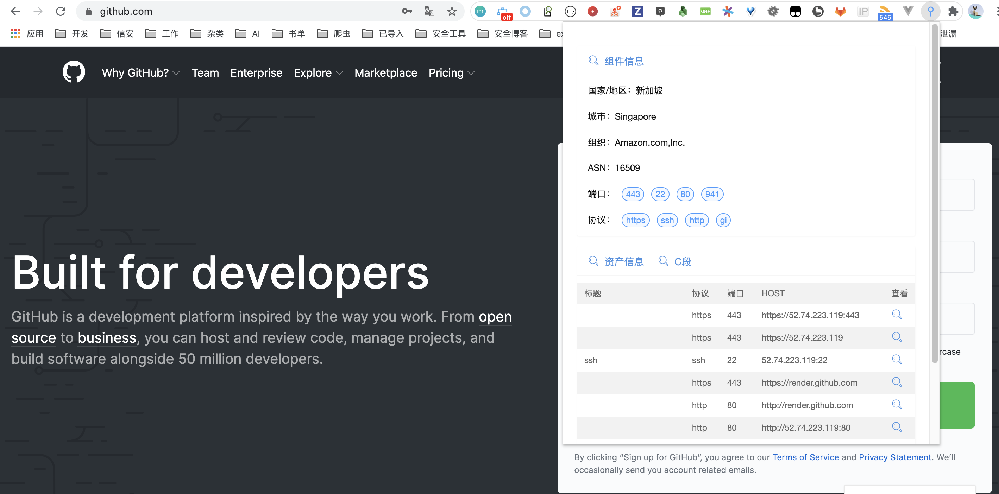
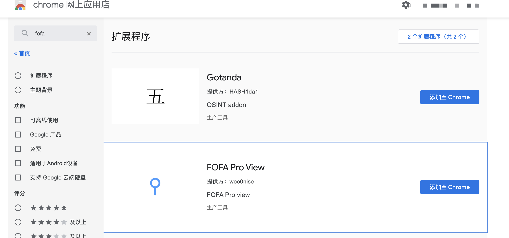
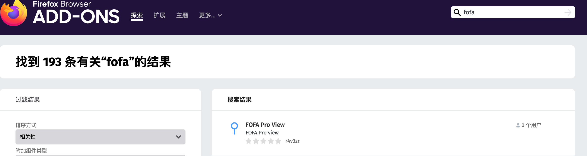

# FOFA Pro view

FOFA Pro view 是一款FOFA Pro 资产展示浏览器插件，目前兼容[Chrome](https://www.google.com/chrome/)、[Firefox](https://www.mozilla.org/)、[Opera](https://www.opera.com/)。

The Fofa Pro View plugin tells you where the website is hosted (country, city), who owns the IP and what other services/ ports are open.

The Fofa Pro View plugin for Chrome automatically checks whether Fofa Pro has any information for the current website. Is the website also running FTP, DNS, SSH or some unusual service? With this plugin you can see all the info that Fofa Pro has collected on a given website/ domain.

项目地址：https://github.com/fofapro/fofa_view

## 安装

### Chrome

#### 手动安装

下载版本：https://github.com/fofapro/fofa_view/releases

解压插件压缩包，打开 [chrome://extensions/](chrome://extensions/) 并且开启开发者模式，点击 `加载已解压的扩展程序` 选择已经解压的插件目录进行加载。

#### 商城安装

### FireFox

#### 手动安装

下载版本：https://github.com/fofapro/fofa_view/releases

解压插件压缩包，打开 [about:debugging#/runtime/this-firefox](about:debugging#/runtime/this-firefox) 点击`临时载入附加组件…`选择下载的插件压缩包。

#### 商城安装

## 更新日志

2020-07-18

- 优化：对接新版FOFA Pro
- 优化：协议、端口图标
- 新增：IP 所属组织、ASN
- 新增：IP C段查询

2019-01-04

- 优化：面板上面文字无法直接复制（如ip地址），建议让文字可选取，增加使用便利性
  
- 优化：刷新确认按钮第一次打开有半截藏在屏幕里点不到

- 优化：网络加载较慢导致样式、图标加载失败问题

- 新增：表格Host字段

2019-12-31

- Chrome、Firefox可在商城直接搜索安装

2019-12-29

- 添加IP位置信息
- 添加资产信息
