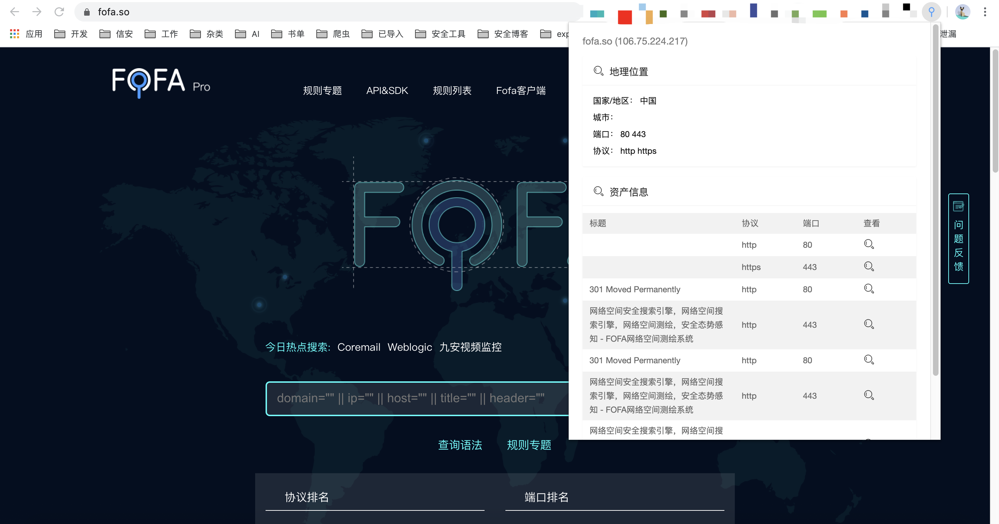
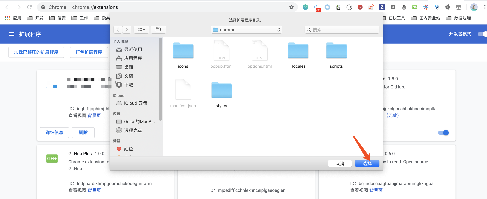
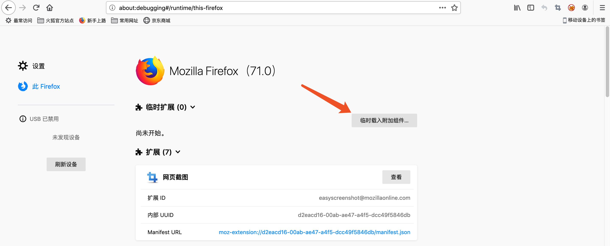

# fofa_view

Fofa pro view 是一款FOFA Pro 资产展示浏览器插件，目前兼容 Chrome、Firefox。

The Fofa Pro View plugin tells you where the website is hosted (country, city), who owns the IP and what other services/ ports are open.

The Fofa Pro View plugin for Chrome automatically checks whether Fofa Pro has any information for the current website. Is the website also running FTP, DNS, SSH or some unusual service? With this plugin you can see all the info that Fofa Pro has collected on a given website/ domain.

## 安装

### Chrome

#### 手动安装

下载版本：https://github.com/0nise/fofa_view/releases

解压插件压缩包，打开 <chrome://extensions/> 并且开启开发者模式，点击 `加载已解压的扩展程序` 选择已经解压的插件目录进行加载。

#### 商城安装

暂且不支持，插件正在申请提交中。

### FireFox

#### 手动安装

下载版本：https://github.com/0nise/fofa_view/releases

解压插件压缩包，打开 <about:debugging#/runtime/this-firefox> 点击`临时载入附加组件…`选择下载的插件压缩包。

#### 商城安装

暂且不支持，插件正在申请提交中。

## 更新日志

2019-12-29

- 添加IP位置信息
- 添加资产信息
